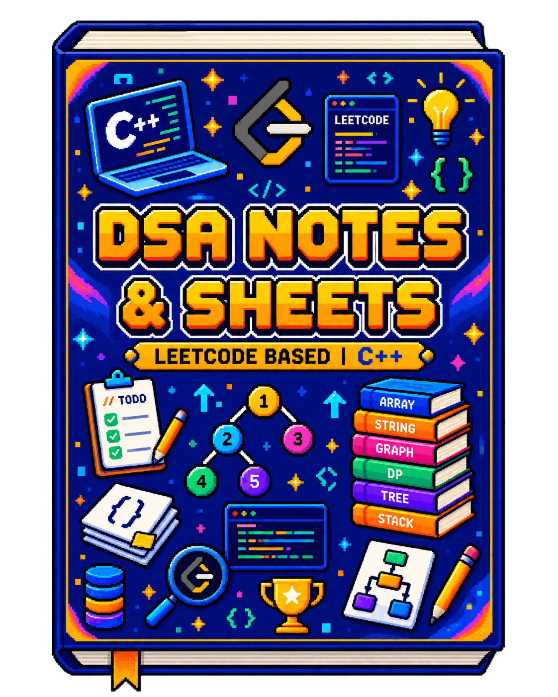

# DSA Notes & Sheets

A fast reference guide and interactive tracker for Data Structures and Algorithms with clean C++ notes.

<p align="center">
  
</p>

> **[Digital Version](https://dummy-dsa.vercel.app)**

### Navigation

- [Index](docs/index.md) — Chapter notes and topic directory
- [Cheat Sheet](docs/cheatsheet.md) — Complexity bounds and C++ templates
- [Problem Sheet](docs/problems.md) — Curated 150 LeetCode problems

### What Makes This Different

- **Zero-Build Architecture**: Instant load times with client-side Markdown, Prism syntax highlighting, and KaTeX math.
- **Interactive Problem Tracker**: Built-in progress tracking with status markers, pattern grouping, and local persistence.
- **High-Density C++ Reference**: Clean, idiomatic modern C++ without namespace boilerplate or fluff.
- **Deep Topic Linking**: Direct anchor routing across all 34 chapters, cheat sheets, and problem walkthroughs.

### Run Locally

```bash
npx serve .
# or: python -m http.server 8000
```

### Directory Structure

```text
dsa-notes/
├── index.html          # Interactive SPA web reader & problem tracker
├── assets/
│   ├── style.css       # Clean dark/light design system & themes
│   ├── script.js       # Client-side router, KaTeX & tracker engine
│   └── cover.png       # Guide illustration cover
├── docs/
│   ├── index.md        # Table of contents & chapter links
│   ├── cheatsheet.md   # Algorithm & data structure cheat sheet
│   ├── problems.md     # 150-problem sheet with company tags
│   ├── problems.json   # Problem dataset for tracker search & filters
│   ├── chapters/       # 34 detailed chapter markdown notes
│   └── solutions/      # LeetCode problem solution breakdowns
```
